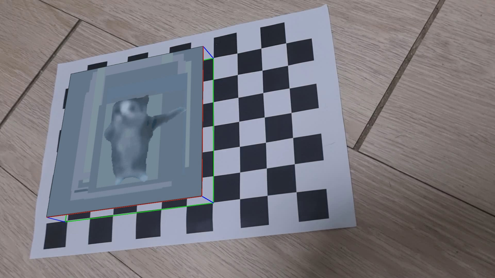

# 📌 Computer Vision HW4: Camera Pose Estimation and AR

본 과제는 카메라 캘리브레이션 결과를 이용하여 **카메라의 자세(pose)를 추정하고**, 그 결과를 바탕으로 체스보드 영상 위에 간단한 **AR 오브젝트(큐브)** 를 시각화하는 것이 목표입니다.

---

## ✅ 과제 목표
- 카메라 캘리브레이션 결과 (`K`, `dist`) 를 활용
- 체스보드 영상에서 카메라의 자세 (`rvec`, `tvec`) 를 추정
- 3D 공간상에 큐브 형태의 AR 오브젝트를 영상 위에 정확히 표시

---

## 🔧 주요 구현 사항

### 1. 카메라 자세 추정
- `cv.findChessboardCornersSB()`를 통해 체스보드 코너 검출
- `cv.solvePnP()`를 이용해 카메라의 회전 벡터(`rvec`)와 이동 벡터(`tvec`) 추정

### 2. AR 오브젝트 시각화
- 3D 공간에 정의된 큐브(6x6x1 크기)를 `cv.projectPoints()`를 통해 2D 영상에 투사
- 상단면에 고양이 움짤(`happy_cat.gif`)을 투영하여 시각적 효과 추가
- 영상 위에 정확한 3D 큐브 경계선 및 텍스처 합성

### 3. 사용한 영상
- 이전 과제에서 사용한 체스보드 영상 `chessboard.mp4`
- 내부 파라미터는 과제 3의 캘리브레이션 결과를 그대로 활용

---

## 🖼️ 결과 예시
아래는 최종 결과 영상에서 캡처한 이미지입니다:

---

## 📁 파일 구조
| 파일명                    | 설명                              |
|-------------------------|---------------------------------|
| `cv_hw4.py`             | AR 큐브 생성 및 영상 저장 코드         |
| `chessboard.mp4`        | 입력 체스보드 영상                    |
| `happy_cat.gif`         | 큐브 상단에 투영되는 움짤               |
| `screenshot.jpg`        | 결과 캡처 이미지                     |
| `chessboard_arCube_withCat.mp4` | 최종 출력 영상 (AR 적용됨)        |

---

## 📝 참고 사항
- 왜곡 보정된 영상을 다시 사용하는 경우, `dist_coeff=None` 처리가 필요함 (이번 과제에서는 원본 영상 사용)
- 모든 AR 투사는 `cv.projectPoints()`로 이루어졌으며, 정확한 카메라 자세 반영을 위해 왜곡 계수와 함께 사용함
- 3D 큐브 위치는 체스보드의 가장 왼쪽 위 교차점을 기준으로 6x6 크기로 설정됨

---

과제에 대한 질문이나 개선 아이디어가 있다면 언제든지 제안해주세요 😎

